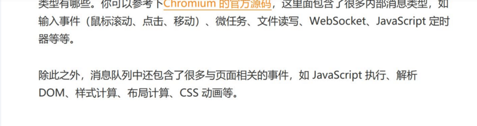

### 什么是事件循环

事件循环是一种解决`javaScript`单线程运行时不会阻塞的运行机制 ，结合消息队列让整个页面有序执行。

事件循环运行原理：通过模拟一个循环每次去读取消息队列中一个任务并且丢主线程中执行，里面还会维护一个延迟队列用来保存定时器、延时器。这也是为什么定时器会不能准时执行原因，在执行延迟队列时还会处理消息队列中任务。

消息队列任务来源：渲染进程、网络进程、js异步代码、用户交互行为等

### 什么是宏任务、微任务

消息队列中的任务称为宏任务，有script、settimeout、setinterval、setimmediate等

微任务是一个需要异步执行的函数，执行时机是在主函数执行结束之后、当前宏任务结束之前。promise.then、mutationObserve

### 用户输入URL的过程

用户输入URL到页面展示大致分为5步：

* 用户输入URL，判断当前是否有浏览器强缓存(cache-control、expires)。
* 解析URL，通过DNS域名解析服务器把域名解析成对应IP，浏览器会进行DNS缓存。
* 拿到ip地址进行tcp连接，三次握手（由客户端发起）。
* 建立好连接浏览器构建相关请求信息、发送请求，然后服务器解析请求并且响应相关数据。
* 浏览器拿到响应数据，会判断状态码、响应内容，进行重定向、协商缓存如果是html内容进入渲染阶段。（这里可以展开状态码说）
  判断是否301、302、304等相关状态码进行重定向（location）和协商缓存（etag、last-modified）。
  content-type的内容类型判断是否问html还是其他类型。如果是HTML把数据丢给渲染进程，在这一步会进行**提交文档**给浏览器主进程去更新对应的安全信息、历史记录、地址栏信息。
* 渲染进程通过生成dom、cssom、抽象语法树等进行生成对应位图页面。渲染页面就结束了

> 渲染处理阶段

1. **构建dom树**。

2. **构建出styleSheet，计算样式**。

3. **构建布局树**。对元素进行布局，并计算元素的布局信息。（会过滤不可渲染的元素）

4. **构建图层树**。进行分层，构建图层树

   因为页面中有很多复杂的效果，如一些复杂的 3D 变换、页面滚动，或者使用 z-indexing做 z 轴排序等

   以上四个步骤是在浏览器主进程执行的。（重排和重绘会重新到2、3开始执行）

5. **绘制列表**。每个图层生成绘制列表，交由合成线程处理。

6. **合成过程**。合成图块、绘制可视区的附近位图（合成线程处理）

   **合成线程会按照视口附近的图块来优先生成位图，实际生成位图的操作是由栅格化线程池里执行的。所谓栅格化，是指将图块转换为位图**

7. **显示过程**。合成线程会提交一个命令“DrawQuad”给浏览器主进程，浏览器主进程viz组件接收到命令，将其页面内容绘制到内存中，最后再将内存显示在屏幕上。

### 浏览器重绘和回流

1. 重绘

   指得是页面中dom发生了几何位置的变化，都会导致浏览器进行页面绘制。宽高、maigin等

2. 回流

   指得是页面中dom发生了外观变化无几何位置变化，会导致浏览器进行页面绘制、跳过布局和分层阶段。color、backgroundColor等

### 如何避免重绘和回流

1. 避免多次修改dom的css属性，通过class操作。
2. 通过创建文档碎片统一处理完dom在渲染到页面。
3. 动画尽量通过transform、transition、animation、position的绝对定位和固定定位。

###  CSS 文件阻塞dom合成吗？

不阻塞dom合成，可能会阻塞页面的渲染，js操作dom时会先加载出css样式，计算出cssom。

### 浏览器网络缓存

https://juejin.cn/post/7051411987502202917

### 浏览器本地缓存

1. cookie
   * 默认自动携带到网络请求头
   * 默认大小4kb左右
   * 无集成api
   * 属性
     1. HttpOnly（是否让js读取）：true/false
     2. SameSite（设置域名请求头是否自动携带cookie）：Strict(当前域名)/Lax/none(默认)
     3. expires（设置储存时间）
     4. path（路径）
     5. doman
2. localStorage
   * 默认大小5mb（各个浏览器不一致）
   * 拥有现成api
   * 永久性存储
3. sessionStorage
   * 当前页面会话结束后即删除
   * 拥有现成api

### 前端安全问题

1. xss(注入脚本攻击)

   * 存储型（用户输入一些不合法的字段前端没有做校验处理保存在数据库中，导致在前端展示时通过js代码执行）
     读取用户cookie、弹出广告弹窗。

   * 反射型（jsonp）

     设置cookie值只读、设置token。

2. csrf(跨站请求伪造)

   * 自动get请求，通过src属性（img、script）拼接好一个涉及到用户敏感信息的接口发送出去。

   * 自动post（同理盗窃cookie发送）

   * 被动点击链接（同理盗窃cookie发送）

     校验referen首部、设置cookie属性SameSite：Strict禁止其他域名下自动携带。

### 浏览器内核

1. chrome（webkit 、blink）
2. ie（Trident ）
3. Firefox（Gecko）

